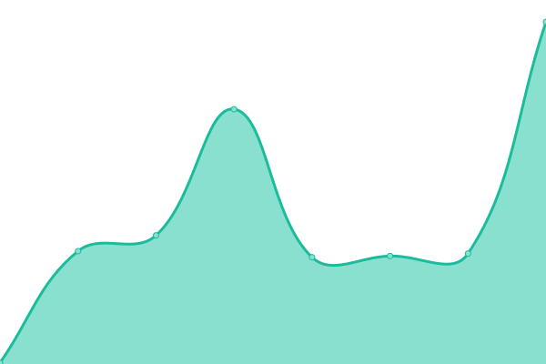

# [📈 Live Status](https://upptime.varianceinfotech.com): <!--live status--> **🟧 Partial outage**

This repository contains the open-source uptime monitor and status page for [manojvipl](https://upptime.varianceinfotech.com), powered by [Upptime](https://github.com/upptime/upptime).

With [Upptime](https://upptime.js.org), you can get your own unlimited and free uptime monitor and status page, powered entirely by a GitHub repository. We use [Issues](https://github.com/manojvipl/upptime/issues) as incident reports, [Actions](https://github.com/manojvipl/upptime/actions) as uptime monitors, and [Pages](https://upptime.varianceinfotech.com) for the status page.

<!--start: status pages-->
<!-- This summary is generated by Upptime (https://github.com/upptime/upptime) -->
<!-- Do not edit this manually, your changes will be overwritten -->
<!-- prettier-ignore -->
| URL | Status | History | Response Time | Uptime |
| --- | ------ | ------- | ------------- | ------ |
|  [VIPL-Website](https://varianceinfotech.com) | 🟩 Up | [vipl-website.yml](https://github.com/manojpvipl/upptime/commits/HEAD/history/vipl-website.yml) | 

 505ms
     
 | 

<a href="https://upptime.varianceinfotech.com/history/vipl-website">100.00%</a>
    

|  [CRMTiger-Website](https://crmtiger.com) | 🟩 Up | [crm-tiger-website.yml](https://github.com/manojpvipl/upptime/commits/HEAD/history/crm-tiger-website.yml) | 

 339ms
     
 | 

<a href="https://upptime.varianceinfotech.com/history/crm-tiger-website">100.00%</a>
    

|  [Demo-Website](https://realtyshine.com) | 🟩 Up | [demo-website.yml](https://github.com/manojpvipl/upptime/commits/HEAD/history/demo-website.yml) | 

 3616ms
     
 | 

<a href="https://upptime.varianceinfotech.com/history/demo-website">100.00%</a>
    

|  [Saleshiker-Website](https://saleshiker.com) | 🟩 Up | [saleshiker-website.yml](https://github.com/manojpvipl/upptime/commits/HEAD/history/saleshiker-website.yml) | 

 733ms
     
 | 

<a href="https://upptime.varianceinfotech.com/history/saleshiker-website">100.00%</a>
    

|  [Test Broken Site](https://thissitedoesnotexist.koj.co) | 🟥 Down | [test-broken-site.yml](https://github.com/manojpvipl/upptime/commits/HEAD/history/test-broken-site.yml) | 

 0ms
     
 | 

<a href="https://upptime.varianceinfotech.com/history/test-broken-site">0.00%</a>
    

|  [IPv6 test](forwardemail.net) | 🟥 Down | [i-pv6-test.yml](https://github.com/manojpvipl/upptime/commits/HEAD/history/i-pv6-test.yml) | 

 0ms
     
 | 

<a href="https://upptime.varianceinfotech.com/history/i-pv6-test">0.00%</a>
    

<!--end: status pages-->

[**Visit our status website →**](https://upptime.varianceinfotech.com)

## 📄 License

- Powered by: [Upptime](https://github.com/upptime/upptime)
- Code: [MIT](./LICENSE) © [Anand Chowdhary](https://anandchowdhary.com), supported by [Pabio](https://pabio.com)
- Data in the `./history` directory: [Open Database License](https://opendatacommons.org/licenses/odbl/1-0/)
